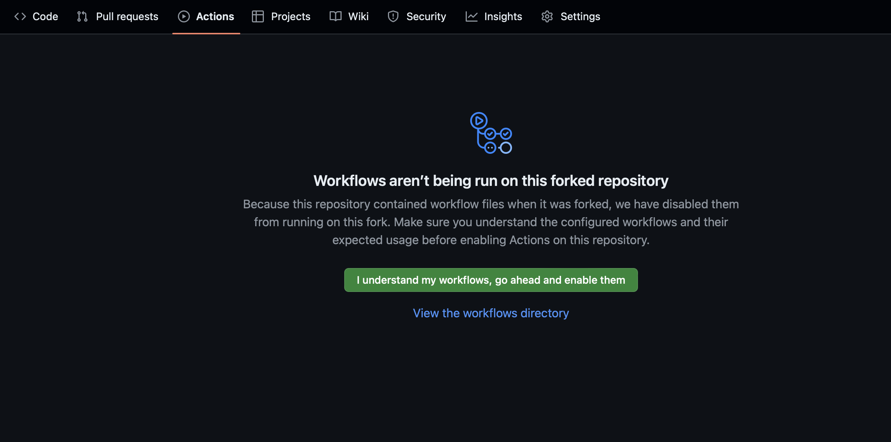
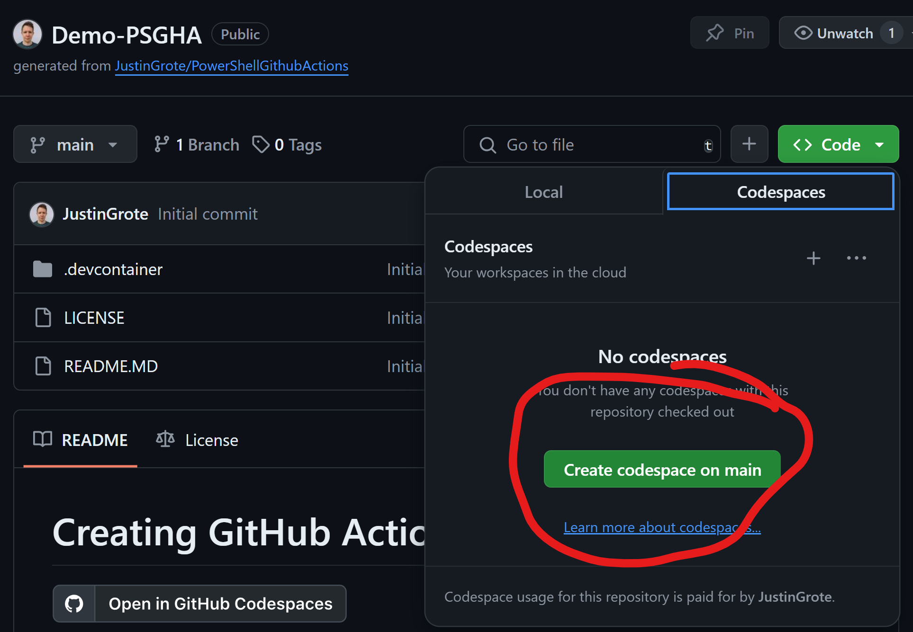

# Creating GitHub Actions with PowerShell

This is a demo of how to develop custom GitHub Actinos in PowerShell. This repository is the companion to the PSConfEU 2024 Presentation **Building Custom GitHub Actions in PowerShell**

## Follow Along Setup

If you run into any problems with this setup feel free to reach out to @JustinWGrote on Twitter/X or file an issue in this repository.

[GitHub Codespaces](https://github.com/features/codespaces) provides a complete preconfigured development environment that runs in GitHub. GitHub provides all users 60 hours a month of free usage. You do not even need Visual Studio Code **installed** locally, it can run within your browser.

### Common Setup

1. [Sign up for a GitHub account](https://github.com/join) if you do not already have one. It is free to join.
1. [Fork the Repository](https://github.com/JustinGrote/PowerShellGithubActions/fork), this will create a copy of the repository in your account, and give you a way to pull future changes.
1. Enable Github Actions in your new repository by going to the `Actions` tab and accept to enable them. You don't have to trust me, feel free to review the GitHub Actions before you do, but the initial examples are all manually triggered.

### Option 1: Online/Codespaces (recommended)

1. The first part of the process will just use the embedded Actions editor, which is pretty good. The second part we will go into some vscode tooling.
1. Go to your forked repo and click `Create Codespace on Main` 
1. If you have Visual Studio Code installed, it will prompt you to open a link in Visual Studio code to connect to your codespace, otherwise the web version of Visual Studio Code will open in your browser and connect to the codespace.
1. The codespace may take several minutes to load.
1. **Congratulations!** You are now ready to start your GitHub Action development journey.

### Option 2: Devcontainer

This is an option if you wish to work "offline". It does not require a GitHub account, though we still recommend a GitHub Account as you will not be able to make pull requests to test the lab exercises or run GitHub Actions without one.

1. Follow the [Dev Containers Tutorial](https://code.visualstudio.com/docs/devcontainers/tutorial) to setup devcontainers on your local computer.
1. Clone your fork to a local folder and then open it in Visual Studio Code.
1. You should be prompted to reopen the project in a devcontainer.
1. **Congratulations!** You are now ready to start your Github Action development journey.

### Option 3: Local Development

If you prefer local development, you can simply clone this GitHub repository and work locally. It is recommended you install the [GitHub Actions VSCode Extension](https://marketplace.visualstudio.com/items?itemName=GitHub.vscode-github-actions).
